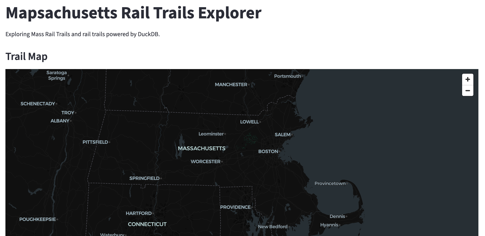

# Mapsachusetts

Mapsachusetts is a high-performance, lightweight geospatial pipeline and interactive mapping tool designed to ingest, process, and visualize cycleways and rail trails across Massachusetts. 

It leverages OSMnx for OpenStreetMap ingestion, DuckDB for spatial vector processing and GeoParquet compression, Pytest for data contract testing, and Streamlit + PyDeck for high-framerate WebGL visualization.

---

## Architecture & Stack

* **Ingestion:** OSMnx & GeoPandas (fetching vector trail geometries)
* **Processing & Querying:** DuckDB (Spatial Extension, `ST_Length_Spheroid` ellipsoid calculations)
* **Storage Format:** GeoParquet (`data/processed/rail_trails.parquet`)
* **Testing & CI/CD:** Pytest + Ruff (linting) via GitHub Actions
* **Frontend UI:** Streamlit with PyDeck (interactive WebGL layer rendering)
* **Orchestration:** Makefile

---

## Project Structure

```
mapsachusetts/
├── .github/
│   └── workflows/
│       └── ci.yml         # Continuous integration test runner
├── data/
│   ├── raw/               # Downloaded GeoJSON geometries
│   └── processed/         # Compressed DuckDB GeoParquet files
├── logs/                  # Standardized runtime pipeline logs
├── scripts/
│   ├── ingest.py          # OSMnx OpenStreetMap fetcher
│   ├── process.py         # DuckDB spatial transformation & Parquet writer
│   └── logger.py          # Dual-output logging configuration
├── queries/               # Standalone DuckDB spatial exploratory scripts
├── tests/                 # Pytest suite validating schemas and geometries
├── app.py                 # Interactive Streamlit dashboard
├── main.py                # Pipeline orchestrator entrypoint
├── Makefile               # Developer CLI commands
└── pyproject.toml         # Tool configurations (Ruff, pytest)
```

---

## Quickstart

### 1. Prerequisites & Installation

Clone the repository and set up your virtual environment:

```bash
git clone https://github.com/your-username/mapsachusetts.git
cd mapsachusetts

python3 -m venv .venv
source .venv/bin/activate
make install
```

### 2. Run the Full Pipeline

Ingest raw data, execute spatial DuckDB transformations, and build the Parquet dataset:

```bash
make pipeline
```

### 3. Launch the Interactive Web App

Spin up the local Streamlit application:

```bash
make app
```

Your browser will automatically open to `http://localhost:8501`.



---

## Developer CLI (Makefile)

This project uses a Makefile to streamline common developer tasks:

| Command | Action |
| :--- | :--- |
| `make pipeline` | Runs the full ETL workflow (`main.py`) |
| `make app` | Launches the Streamlit map interface |
| `make test` | Executes the pytest test suite |
| `make format` | Formats and lints code using `ruff` |
| `make explore` | Executes DuckDB exploratory CLI queries |
| `make clean` | Removes cached files and log artifacts |

---

## Testing & CI/CD

### Local Test Execution
The test suite validates spatial file contracts, DuckDB schema definitions, coordinate ranges, and distance calculation outputs:

```bash
make test
```

### GitHub Actions (Continuous Integration)
Automated testing is configured via `.github/workflows/ci.yml`. On every `push` or `pull_request` to `main`, GitHub Actions automatically:
* Installs dependencies using `pyproject.toml`
* Lints and checks formatting via `ruff`
* Executes `pytest` against existing data contracts and utilities

*Note: Automated CI runs purely against unit tests and pre-existing fixture samples—it does not trigger live OpenStreetMap data ingestion.*